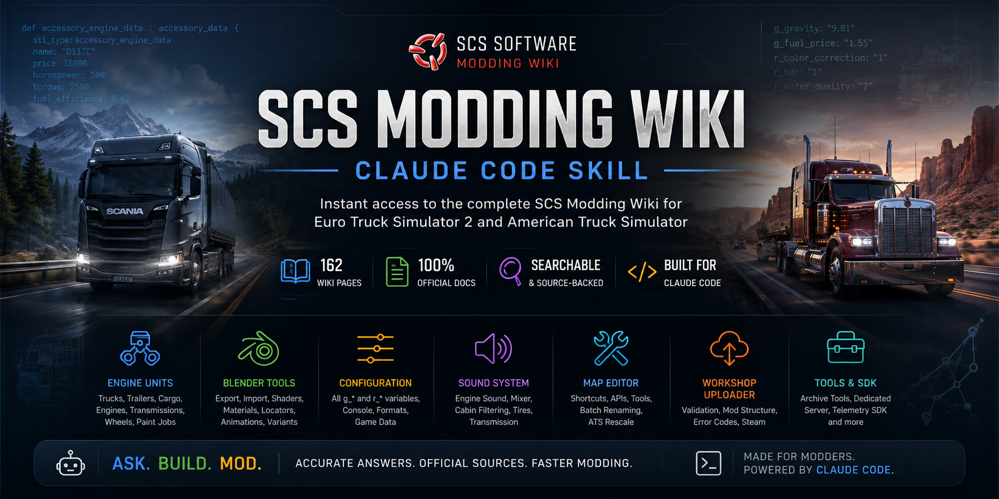

<p align="center">
  
</p>

# SCS Modding Wiki — Claude Code Skill

> A [Claude Code](https://claude.ai/code) skill that gives AI assistants instant access to the complete [SCS Software Modding Wiki](https://modding.scssoft.com/wiki/Documentation) — Documentation mirror generated from 162 pages covering ETS2 and ATS modding.

[](LICENSE)
[](skill/crawl_report.md)
[](https://claude.ai/code)
[](https://github.com/MBCustoms/scs-modding-wiki-skill)

---

## Table of Contents

- [What This Does](#what-this-does)
- [Documentation Coverage](#documentation-coverage)
- [Quick Start](#quick-start)
- [Installation](#installation)
- [Usage](#usage)
- [Example Prompts](#example-prompts)
- [Repository Structure](#repository-structure)
- [Updating the Wiki Mirror](#updating-the-wiki-mirror)
- [Contributing](#contributing)
- [License & Attribution](#license--attribution)
- [Credits](#credits)

---

## What This Does

This repository packages the entire SCS Software Modding Wiki into a Claude Code skill. When activated, Claude has direct access to official documentation and can answer ETS2/ATS modding questions with precision — citing exact source pages, referencing parameter names, and cross-linking related topics.

**Without this skill:** Claude answers from general training knowledge, which may be incomplete, outdated, or imprecise about game-specific formats.

**With this skill:** Claude reads the actual documentation — unit definitions, shader lists, sound parameters, workshop validation rules — and answers with source-backed accuracy.

---

## Documentation Coverage

| Category | Pages | Topics |
|---|---|---|
| Engine Units | 46 | Truck accessories, trailers, cargo, engines, transmissions, paint jobs, wheels |
| Blender Tools | 33 | Export, import, materials, shaders, locators, animations, variant system |
| Engine Config | 23 | All configuration variables (g_*, r_*) |
| Engine Core | 18 | Console, formats, fonts, game data, mod manager, detours, multi-monitor |
| Engine Sound | 12 | Sound modding, truck audio, mixer, cabin filtering, tires, transmission |
| Workshop Uploader | 11 | Validation, error codes, mod structure, Steam formatting |
| Map Editor | 10 | Shortcuts, batch renaming, ATS rescale, sector/note APIs |
| Tools | 6 | Archive extractor/packer, conversion tools, dedicated server, font generator |
| Engine SDK | 2 | Telemetry SDK and changelog |
| Root | 1 | Documentation index |
| **Total** | **162** | **Complete official SCS modding documentation** |

**Source:** [modding.scssoft.com/wiki/Documentation](https://modding.scssoft.com/wiki/Documentation)
**Last crawled:** 2026-06-10

---

## Why Use This Skill?

- Official SCS documentation available directly inside Claude Code
- No need to manually search the wiki
- Source-aware answers
- Cross-referenced documentation
- Offline documentation access
- Faster ETS2 and ATS mod development workflows

---

## Quick Start

```bash
# 1. Clone the repository
git clone https://github.com/MBCustoms/scs-modding-wiki-skill.git

# 2. Install the skill
# Windows (PowerShell):
Copy-Item -Recurse -Force "scs-modding-wiki-skill\skill" "$env:USERPROFILE\.claude\skills\scs-modding-wiki"

# macOS / Linux:
cp -r scs-modding-wiki-skill/skill ~/.claude/skills/scs-modding-wiki

# 3. Use it — open Claude Code and ask:
# "How do I define a truck engine in a .sii file?"
```

---

## Installation

### Prerequisites

- [Claude Code](https://claude.ai/code) (CLI or desktop app)
- Git

### Step 1 — Clone

```bash
git clone https://github.com/MBCustoms/scs-modding-wiki-skill.git
cd scs-modding-wiki-skill
```

### Step 2 — Install

**Windows (PowerShell):**
```powershell
$dest = "$env:USERPROFILE\.claude\skills\scs-modding-wiki"
New-Item -ItemType Directory -Force $dest | Out-Null
Copy-Item -Recurse -Force "skill\*" $dest
Write-Host "Installed to $dest"
```

**macOS / Linux:**
```bash
mkdir -p ~/.claude/skills/scs-modding-wiki
cp -r skill/* ~/.claude/skills/scs-modding-wiki/
echo "Installed to ~/.claude/skills/scs-modding-wiki"
```

### Step 3 — Verify

Open any project in Claude Code. The skill loads automatically when Claude encounters ETS2/ATS modding questions. You can also invoke it explicitly:

```
/scs-modding-wiki
```

Or ask Claude directly:
```
Using the scs-modding-wiki skill, how do I set up a trailer definition?
```

### Project-Local Installation (Optional)

To install the skill for a specific modding project only, copy to the project's `.claude/skills/` directory:

```powershell
# Windows
Copy-Item -Recurse -Force "skill" ".\.claude\skills\scs-modding-wiki"
```

```bash
# macOS / Linux
cp -r skill .claude/skills/scs-modding-wiki
```

---

## Usage

Once installed, Claude Code automatically activates this skill when you ask modding questions. The skill:

1. Searches `index.json` to find relevant documentation pages
2. Reads the matching files from `docs/`
3. Cites the source URL from the official SCS wiki
4. Cross-references related pages when relevant
5. Flags deprecated patterns explicitly

Claude will always cite its source. If an answer references `accessory_engine_data`, it links to the exact wiki page.

---

## Example Prompts

### Truck Modding

```
How do I define a truck engine accessory in a .sii file?
What parameters are required in accessory_cabin_data?
How do I add a custom paint job to a truck?
```

### Trailer & Cargo

```
What's the difference between trailer_def and trailer_configuration?
How do I define a cargo mod with custom weight?
What unit type handles trailer cable physics?
```

### Sound Modding

```
How does the truck engine sound system work?
What parameters control cabin sound filtering?
How do I mod the tire sound?
```

### Blender Tools

```
What shaders does SCS Blender Tools support?
How do I set up collision locators for a model?
What is the intended workflow for exporting a truck model?
```

### Map Editor

```
What are the Map Editor keyboard shortcuts?
How does the Sector lock API work?
What changed in Map Editor 1.49?
```

### Workshop Uploader

```
What is the mod structure required for Workshop upload?
How do I fix Workshop validation error WE001?
What is the difference between a Workshop mod and a standard mod?
```

### Config Variables

```
What does g_trans do?
How does r_color_correction work?
What is g_grass_density used for?
```

### Console Commands

```
What console commands are available in the Map Editor?
How do multimon console commands work?
```

---

## Repository Structure

```
scs-modding-wiki-skill/
├── .github/
│   ├── ISSUE_TEMPLATE/          # Bug, doc issue, skill improvement, wiki sync templates
│   ├── PULL_REQUEST_TEMPLATE.md
│   └── FUNDING.yml
├── docs/                        # Project documentation
│   ├── installation.md          # Detailed installation guide
│   ├── updating.md              # How to re-crawl and update the wiki mirror
│   ├── architecture.md          # Skill internals and design
│   ├── data-sources.md          # Data sourcing and attribution
│   ├── coverage.md              # Full documentation coverage report
│   ├── faq.md                   # Frequently asked questions
│   └── troubleshooting.md       # Common issues and solutions
├── examples/                    # Worked modding examples using the skill
│   ├── ets2-truck-mod.md
│   ├── ats-mod.md
│   ├── sii-unit-files.md
│   ├── map-editor.md
│   ├── blender-tools.md
│   ├── sound-modding.md
│   └── workshop-uploader.md
├── scripts/
│   └── update-wiki.ps1          # Script to re-crawl the SCS wiki
├── skill/                       # The Claude Code skill (install this)
│   ├── SKILL.md                 # Skill definition and instructions
│   ├── index.json               # Search index (162 pages)
│   ├── sources.json             # URL → file mapping
│   ├── crawl_report.md          # Crawl status and page list
│   └── docs/                   # Documentation mirror generated from 162 pages as Markdown
│       ├── index.md
│       ├── engine.md
│       ├── engine/
│       │   ├── units/           # 46 unit definition pages
│       │   ├── sound/           # 12 sound system pages
│       │   ├── configuration_variables/  # 16 config var pages
│       │   ├── config_variables/         # 6 older config var pages
│       │   ├── console/         # Console and commands
│       │   ├── sdk/             # Telemetry SDK
│       │   └── ...
│       └── tools/
│           ├── scs_blender_tools/  # 33 Blender Tools pages
│           ├── scs_workshop_uploader/  # 11 Workshop pages
│           ├── map_editor/      # 10 Map Editor pages
│           └── ...
├── README.md
├── LICENSE
├── CONTRIBUTING.md
├── CODE_OF_CONDUCT.md
├── CHANGELOG.md
├── SECURITY.md
├── .gitignore
└── PROJECT_STRUCTURE.md
```

---

## Updating the Wiki Mirror

The skill content was crawled from the official SCS Modding Wiki. To refresh it with the latest wiki content:

```powershell
# Requires Claude Code CLI with WebFetch capability
.\scripts\update-wiki.ps1
```

See [docs/updating.md](docs/updating.md) for the full update process, including how to handle partial updates and validate the results.

If you notice a wiki page is out of date, please [open an issue](https://github.com/MBCustoms/scs-modding-wiki-skill/issues/new/choose) using the **Wiki Sync Issue** template.

---

## Contributing

Contributions are welcome. The most valuable contributions are:

- **Wiki sync reports** — pages that have changed on the official wiki
- **Coverage gaps** — modding topics that are missing or incomplete
- **Usage examples** — real-world modding questions and answers
- **Installation fixes** — better scripts, platform compatibility

See [CONTRIBUTING.md](CONTRIBUTING.md) for the full contribution guide.

---

## License & Attribution

**Skill infrastructure** (SKILL.md, index.json, scripts, documentation): [MIT License](LICENSE)

**Wiki content** (`skill/docs/`): All documentation content is sourced from the [SCS Software Modding Wiki](https://modding.scssoft.com/wiki/Documentation) and remains the intellectual property of [SCS Software](https://www.scssoft.com/). This repository mirrors wiki content for offline AI-assisted use. Users are encouraged to consult the [official wiki](https://modding.scssoft.com/wiki/Documentation) for the most current information.

All original documentation, trademarks, game assets, and related intellectual property belong to SCS Software.

If requested by SCS Software, any copyrighted content will be removed or updated accordingly.

This project is not affiliated with or endorsed by SCS Software.

---

## Credits

**Maintained by:** [MBCustoms](https://github.com/MBCustoms)

**Data source:** [SCS Software Modding Wiki](https://modding.scssoft.com/wiki/Documentation) — official ETS2/ATS modding documentation by [SCS Software](https://www.scssoft.com/)

**Platform:** [Claude Code](https://claude.ai/code) by Anthropic
